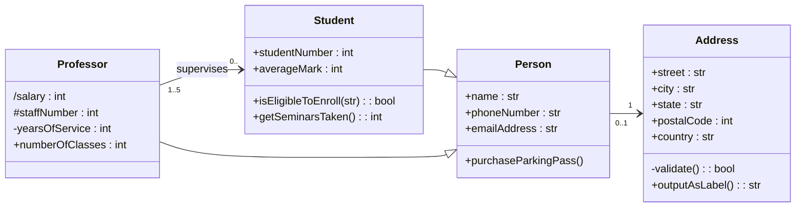
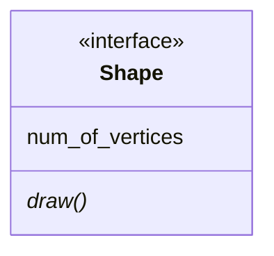
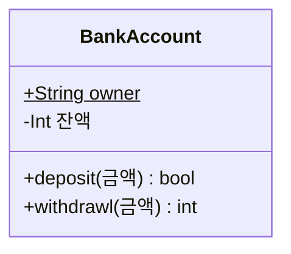
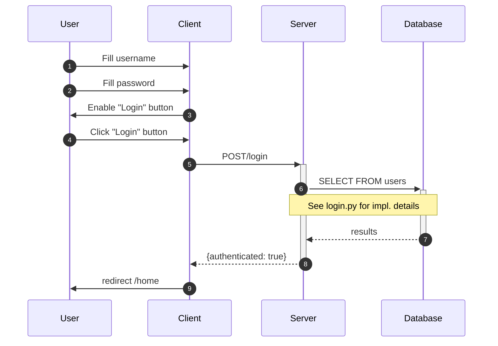
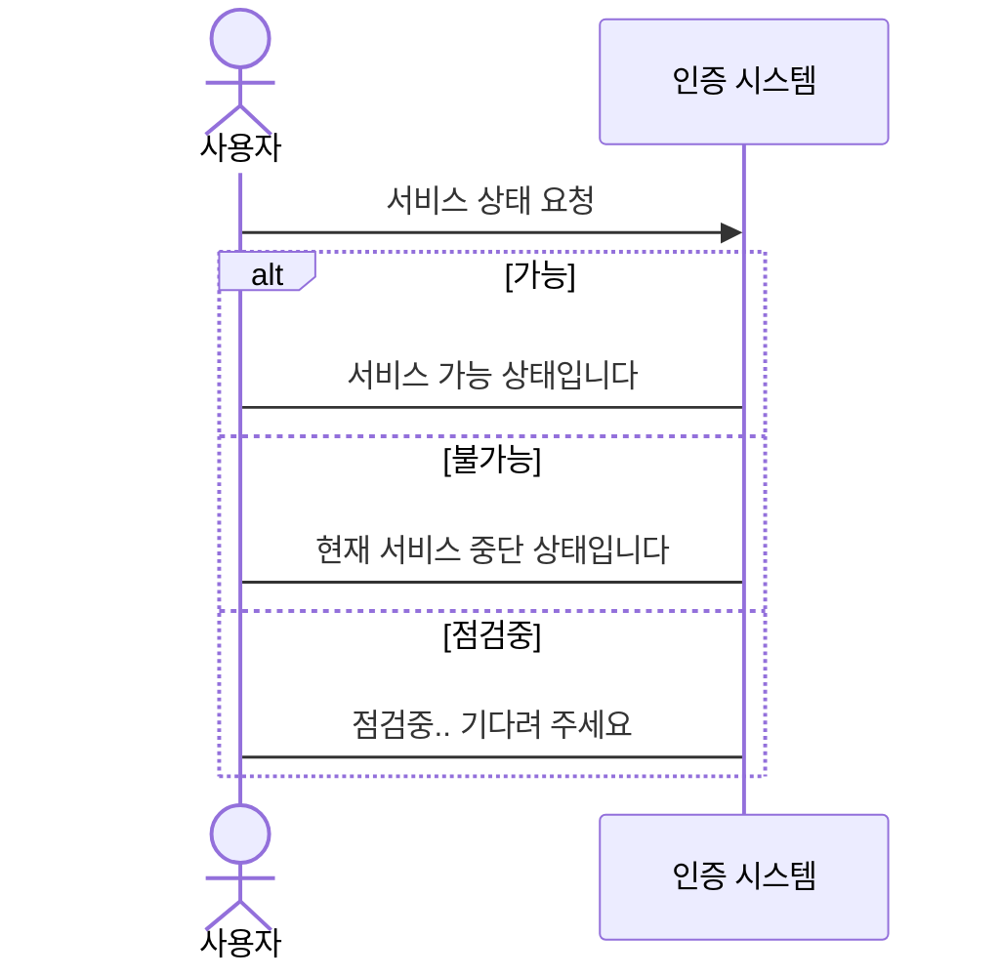
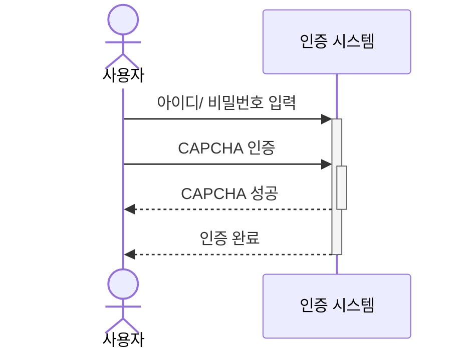

# Mermaid 실습
-  순서도 실습
    - 첫번째 샘플

```mermaid
classDiagram
    direction LR
    class Person{
        +name : str
        +phoneNumber : str
        +emailAddress : str
        +purchaseParkingPass()
    }

    class Student{
        +studentNumber : int
        +averageMark : int
        +isEligibleToEnroll(str) : bool
        +getSeminarsTaken() : int
    }

    class Professor{
        /salary : int
        #staffNumber : int
        -yearsOfService : int
        +numberOfClasses : int
    }

    class Address{
        +street : str
        +city : str
        +state : str
        +postalCode : int
        +country : str
        -validate() : bool
        +outputAsLabel() : str
    }

    Student --|> Person
    Professor --|> Person
    Professor "1..5"--> "0.." Student : supervises
    Person "0..1" --> "1" Address
```

     

```mermaid
classDiagram
    class Shape{
        <<interface>>
        num_of_vertices
        draw()*
    }
```

     

```mermaid
classDiagram
    class BankAccount{
        +String owner$
        -Int 잔액
        +deposit(금액) bool
        +withdrawl(금액) int
    }
```

     

```mermaid
sequenceDiagram
    autonumber
    participant U as User
    participant C as Client
    participant S as Server
    participant D as Database

    U ->> C: Fill username
    U ->> C: Fill password
    C ->> U: Enable "Login" button
    U ->> C: Click "Login" button

    C ->>+ S: POST/login
    S ->>+ D: SELECT FROM users
    Note over S, D: See login.py for impl. details  
    D -->>- S: results
    S -->>- C: {authenticated: true}
    C ->> U: redirect /home
```    

     

```mermaid
sequenceDiagram 
    actor A as 사용자
    participant B as 인증 시스템

    A ->> B: 서비스 상태 요청

    alt 가능
        B -> A : 서비스 가능 상태입니다
    else 불가능
        B -> A : 현재 서비스 중단 상태입니다
    else 점검중
        B -> A : 점검중.. 기다려 주세요
    end
```

     

```mermaid
sequenceDiagram 
    actor A as 사용자
    participant B as 인증 시스템
    A ->>+ B: 아이디/ 비밀번호 입력
    A ->>+ B: CAPCHA 인증
    B -->>- A : CAPCHA 성공
    B -->>- A : 인증 완료
```